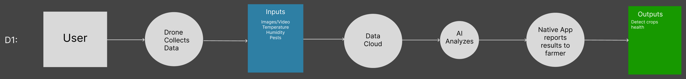

# Design Diagrams 

# OMID USA AI Drone Capstone 

## Part 1 

    As for farmer, I want to check the health of my crops using the drone's defect detection functionality 

    As a fertilizer application engineer, I would like to locate the sections of the field that require additional fertilizer to fertilize my field appropriately. 

    As a farmer, I would like to see the footage of crops and manually spray the pesticides out of schedule when needed too. I would like to also have info on other factors such as temperature, humidity, etc. 

## Part 2 

Diagrams in this section are represented via directed arrows (representing the flow of the data pipeline) and color-coded input and output nodes (blue and green respectively). 

### Design Diagram 0: 

In this diagram, the user initiates for the drone to collect data, which is followed by that analysis of the data from the AI model. After this is finished the health of the crops is output which is based on the analysis of the AI model. 

### Design Diagram 1: 

In this diagram, the user initiates the drone to collect sensor data and collate the inputs to be pushed to cloud storage. The AI Model is then triggered to perform inference on the newly collected data, providing crop analysis reports that can be queried via the farmers native app. Ultimately, the user achieves the goal of determining the health of their crops. 

 

### Design Diagram 2: 

In this diagram, the user initiates the process which leads to the collection of data from the sensors and the drone. The sensors collect stationary data on temperature and humidity while the drone collects multispectral video of the crops. these inputs go to the data cloud from which a pre-trained neural network is used to classify the crops as grapes/not-grapes and as diseased/not-diseased. These classifications are pushed back to the application provided to the farmer, from which they can visualize the health of their crops. 

 

 
