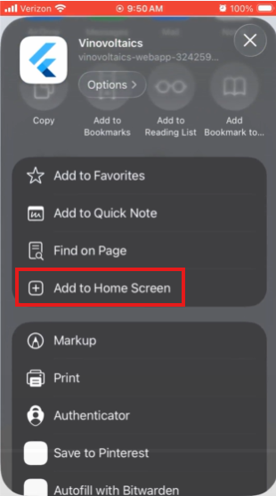
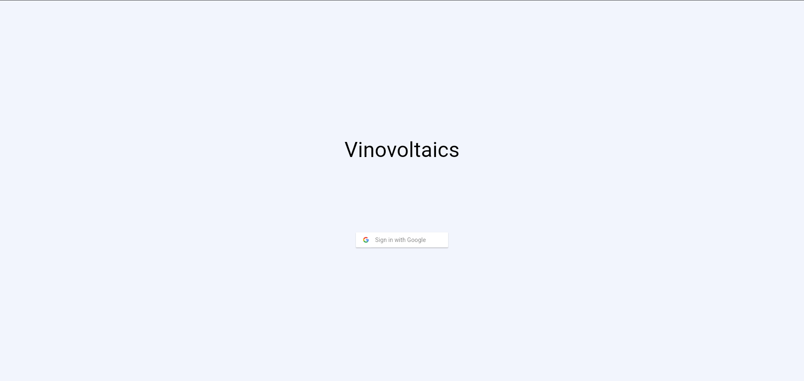
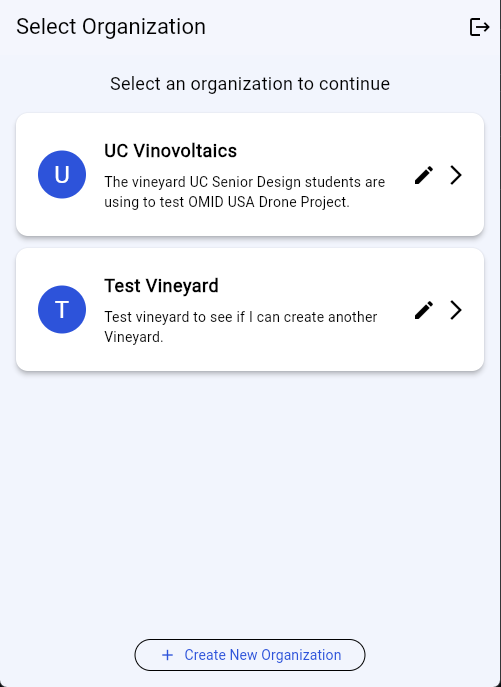
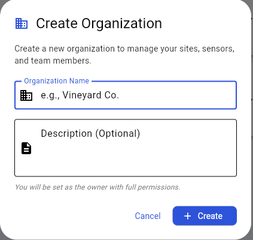

# OMID USA Agrivoltaics System - User Documentation

Welcome to the OMID USA Agrivoltaics System user guide. This documentation will help you get started with monitoring your vineyard using our AI-powered crop health monitoring solution.

---

## Table of Contents

1. [Getting Started](#getting-started)
2. [Installation Guide](#installation-guide)
3. [User Guide](#user-guide)
4. [Feature Reference](#feature-reference)
5. [Troubleshooting](#troubleshooting)
6. [FAQ](#faq)

---

## Getting Started

### What is the Agrivoltaics System?

The OMID USA Agrivoltaics System is a comprehensive agricultural monitoring solution designed for vineyard owners and farm managers. The system combines:

- **AI-powered image analysis** to detect crop diseases and pests
- **Stationary environmental sensors** for real-time monitoring of temperature, humidity, soil conditions, and more
- **Mobile and web application** for easy access to your farm data from anywhere
- **Cloud-based data storage** for historical analysis and trend tracking

### Who Should Use This System?

This system is ideal for:
- **Vineyard owners** who want to monitor crop health
- **Farm managers** responsible for pest and disease management
- **Agricultural technicians** who apply pesticides and fertilizers
- **Agronomists** analyzing crop conditions

### System Requirements

**For the Mobile/Web Application:**
- **Mobile Devices:** iOS 12.0+ or Android 8.0+
- **Web Browsers:** Chrome 90+, Firefox 88+, Safari 14+, or Edge 90+
- **Internet Connection:** Required for real-time data access
- **Google Account:** Required for authentication

**For On-Farm Equipment:**
- Raspberry Pi 5 (8GB) for image capture and processing
- Compatible sensors
- Stable power supply
- Wi-Fi or cellular connectivity

---

## Installation Guide

### Installing the Web Application on Mobile Devices

The Agrivoltaics System is a Progressive Web App (PWA) that works like a native app once installed. No App Store or Play Store download required!

#### iOS (iPhone/iPad)

1. Open **Safari** on your device (must use Safari for iOS installation)
2. Navigate to: **[Agrivoltaics Web App][agrivoltaics-web-app]** *(URL placeholder)*
3. Tap the **Share** button (square with arrow pointing up) at the bottom of the screen
4. Scroll down and tap **Add to Home Screen**
5. Edit the name if desired
6. Tap **Add** in the top right corner
7. The app icon will appear on your home screen
8. Tap the icon to launch the app like any native application



#### Android

1. Open **Chrome** (or your preferred browser) on your device
2. Navigate to: **[Agrivoltaics Web App][agrivoltaics-web-app]** *(URL placeholder)*
3. You'll see a prompt at the bottom: **"Add Agrivoltaics to Home screen"**
   - If you don't see the prompt, tap the **menu icon** (⋮) → **Install app** or **Add to Home screen**
4. Tap **Install** or **Add**
5. The app icon will appear on your home screen and app drawer
6. Tap the icon to launch the app


#### Accessing Without Installation

You can always use the web app directly in any browser:
1. Navigate to: **[Agrivoltaics Web App][agrivoltaics-web-app]** *(URL placeholder)*
2. Bookmark for easy access
3. Works on both desktop and mobile browsers


### Setting Up Hardware (For System Administrators)

**Note:** Hardware setup is typically performed by OMID technicians or trained personnel. If you need to install sensors yourself, please refer to the [Hardware Installation Guide](./Hardware-Installation.md) or contact support.

Basic setup overview:
1. Mount the Raspberry Pi and camera to your farm equipment
2. Install stationary sensors in designated zones
3. Connect sensors to the control box
4. Verify power and network connectivity
5. Register sensors in the application

---

## User Guide

### First-Time Login

1. **Launch the application** (mobile or web)
2. You'll see the welcome screen with a **Sign in with Google** button
3. Tap/click **Sign in with Google**
4. Select your Google account or sign in if not already logged in
5. Grant the necessary permissions when prompted
6. You'll be directed to the **Organization Selection** screen



**Important:** Your email address must be authorized by your organization administrator before you can access farm data. If you see an "Access Denied" message, contact your farm administrator to add your email to the authorized user list. Additionally, you must login to the application via Google before they can add you to the organization since your user account needs to be created.

### Navigating the Application

The app is organized hierarchically to match your farm structure:

```
Organization → Site → Zone → Sensors
```

- **Organization:** Your company or farm group (e.g., "Smith Family Vineyards")
- **Site:** A specific farm location (e.g., "North Vineyard")
- **Zone:** Sections within a site (e.g., "Zone A", "Zone B")
- **Sensors:** Individual monitoring devices within zones

---

## Feature Reference

### Managing Organizations

#### Viewing Your Organizations

After logging in, you'll see all organizations you have access to.

**To select an organization:**
1. Tap/click on the organization card
2. The app will display all sites belonging to that organization



#### Creating a New Organization

1. From the organization screen, tap the **+ New Organization** button
2. Enter organization details:
   - Organization name
   - Description (optional)
   - Location information
3. Tap **Create**
4. You'll be set as the organization administrator



#### Managing Organization Members

**Organization Admins only**

1. Select your organization
2. Tap the **Settings** icon (gear icon)
3. Select **Manage Members**
4. Here you can:
   - **Add members:** Enter email addresses to invite
   - **Change permissions:** Set as Admin, Manager, or Viewer
   - **Remove members:** Revoke access for users


**Permission Levels:**
- **Owner:** Admin-level controls, more of a title than an access controller
- **Admin:** Full control (add/remove users, modify settings, delete data)
- **Manager:** Can add/edit sites, zones, and sensors
- **Viewer:** Read-only access to all data

### Managing Sites

A **site** represents a physical farm location.

#### Adding a New Site

1. Select your organization
2. Tap the **+ Add Site** button
3. Enter site information:
   - Site name
   - Address/location
   - Size (acres/hectares)
   - Crop type
4. Tap **Save**


#### Editing a Site

1. Select the site from the list
2. Tap the **Edit** icon (pencil icon)
3. Modify the site information
4. Tap **Save Changes**

#### Deleting a Site

1. Select the site
2. Tap **Edit** → **Delete Site**
3. Confirm deletion

**Warning:** Deleting a site will also delete all zones and sensor data associated with it. This action cannot be undone.

### Managing Zones

**Zones** are subdivisions within a site. They help you organize sensors and view data from specific farm sections.

#### Why Use Zones?

Zones allow you to:
- Track different crop varieties separately
- Monitor sections with different soil conditions
- Organize sensors by irrigation blocks
- Compare conditions across farm areas

#### Adding a Zone

1. Select your site
2. Tap **Zones** tab
3. Tap **+ Add Zone**
4. Enter zone details:
   - Zone name/identifier
   - Description
   - Area coverage
5. Tap **Save**


**Note:** Every site must have at least one zone before you can add sensors.

#### Viewing Zone Data

1. From your site view, tap on a specific zone
2. The app will filter all sensor readings to show only data from that zone
3. To view all zones, return to the site-level view

### Monitoring Sensors

#### Viewing Real-Time Data

1. Navigate to your site or zone
2. The **Sensors** tab shows all active sensors
3. Each sensor card displays:
   - Sensor name and type
   - Most recent reading
   - Status indicator (online/offline)
   - Last update timestamp

*Screenshot placeholder: [Sensor dashboard with multiple sensor cards]*

**Status Indicators:**
- 🟢 **Green:** Sensor operating normally
- 🔴 **Red:** Sensor offline (>2 hours)

#### Adding a Sensor

**Manager or Admin users only**

1. Navigate to the zone where you want to add the sensor
2. Tap **+ Add Sensor**
3. Enter sensor details:
   - Sensor type (select from dropdown)
   - Sensor ID (usually printed on the device)
   - Location description
   - Installation date
4. Tap **Register Sensor**
5. The system will verify the sensor connection


#### Editing Sensor Information

1. Tap on the sensor card
2. Tap **Edit**
3. Update sensor details (name, location, etc.)
4. Tap **Save**

**Note:** You cannot change the sensor type or ID after registration.

#### Removing a Sensor

1. Tap on the sensor card
2. Tap **Edit** → **Remove Sensor**
3. Choose removal option:
   - **Permanent Delete:** Only available for sensors with no data

**Important:** Sensors with stored readings cannot be permanently deleted to preserve data integrity. Use soft delete to hide inactive sensors while maintaining historical records.

### Mobile Imaging & Disease Detection

**Coming Soon:** This feature is currently under development and will allow real-time disease detection from camera-equipped farm equipment.

The planned functionality includes:
- Automatic disease detection (downy mildew, powdery mildew, black rot)
- Pest identification (spotted lanternfly, etc.)
- Treatment recommendations
- Integration with spray application equipment

### Switching Organizations or Sites

You can easily switch between different organizations or sites without logging out:

1. Tap the **Switch Organization** drop-down in the top left
2. Tap **Create New Organization** or select an existing organization to switch to
3. The app will load the new context

---

## Troubleshooting

### Common Issues and Solutions

#### "Access Denied" or "Not Authorized" Error

**Problem:** You can log in with Google but can't access any farm data.

**Solution:**
- Your email needs to be added to the authorized users list by an organization administrator
- Contact your farm manager or the person who invited you
- Confirm you're using the correct Google account

#### Cannot Add a Sensor

**Problem:** Registration fails or sensor doesn't appear after adding.

**Solutions:**
1. Verify you have **Manager or Admin permissions**
2. Double-check the **sensor ID** (case-sensitive)
3. Ensure the sensor is **powered on and connected**
4. Confirm you created **at least one zone** for the site
5. Check that the sensor isn't already registered to another zone

#### Google Sign-In Not Working

**Solutions:**
1. Ensure you're connected to the internet
2. Update the app to the latest version
3. Clear browser cache (web app) or app cache (mobile)
4. Disable VPN if you're using one
5. Try a different browser (web app) or restart device (mobile)
6. Check Google account status at [accounts.google.com](https://accounts.google.com)

#### Data Appears Incorrect

**Problem:** Sensor readings seem wrong (e.g., impossible temperature values).

**Steps to take:**
1. Check the sensor's physical condition (moisture, dirt, damage)
2. Compare with other nearby sensors
3. Note the specific reading and timestamp
4. Report to support via the app (Menu → Help → Report Issue)
5. System administrators will investigate and may recalibrate the sensor

---

## FAQ (Frequently Asked Questions)

### General Questions

**Q: Do I need special training to use the system?**

A: No special training is required for basic use. The app is designed to be intuitive. However, OMID USA offers optional training sessions for farm staff. Hardware installation should be performed by trained technicians.

**Q: Can multiple people access the same farm data?**

A: Yes! Invite team members through the Member Management feature. You can assign different permission levels (Admin, Manager, Viewer) to control what each person can do.

### Sensor Questions

**Q: How often do sensors send data?**

A: Most sensors update every 5-15 minutes. Exact intervals depend on sensor type and power configuration.

### Account & Access Questions

**Q: I forgot my password. How do I reset it?**

A: The app uses Google Sign-In, so there's no separate password. If you can't access your Google account, use Google's password recovery at [accounts.google.com](https://accounts.google.com).

**Q: Can I use the same account on multiple devices?**

A: Yes! Sign in with your Google account on any device (phone, tablet, computer). Your preferences and data will sync automatically.

**Q: How do I remove someone's access to my farm data?**

A: Only organization administrators can remove users:
1. Go to Settings → Manage Members
2. Find the user
3. Tap Remove
4. Confirm the action

**Q: Can I create separate accounts for different farms?**

A: You don't need separate accounts. One account can access multiple organizations. Ask to be added to each organization you need access to.

### Data & Reporting Questions

**Q: How far back can I view historical data?**

A: As of 2/7/2026, the plan is for all sensor data is retained indefinitely. You can view data from any date since sensor installation.

**Q: Can I export data to use in other programs?**

A: Yes! Export data as CSV files for use in Excel, Google Sheets, or data analysis software. You can also export as JSON for custom programming.

**Q: Can I compare data across different zones or time periods?**

A: Yes! The historical view allows you to overlay data from multiple sensors and different date ranges. Use the comparison tool in the analytics section.

### Disease Detection Questions

**Q: What diseases can the AI detect?**

A: The current AI models are trained to detect:
- Downy mildew
- Powdery mildew  
- Black rot
- Spotted lanternfly (pest)

Additional models are in development.

**Q: How accurate is the disease detection?**

A: Our AI models achieve 90%+ accuracy in field conditions. However, always confirm suspected diseases with visual inspection or lab testing before treatment.

**Q: What should I do if a disease is detected?**

A: The system will provide recommended treatments based on the detected issue. Consult with an agronomist for treatment plans. Document any treatments applied in the app for future reference.

**Q: Can the system recommend pesticide application amounts?**

A: Treatment recommendations include suggested application rates based on industry standards. Always follow pesticide label instructions and local regulations. Consult with licensed pesticide applicators when required.

### Technical Questions

**Q: What mobile operating systems are supported?**

A: iOS 12.0+ and Android 8.0+ are supported. The web app works on all modern browsers.

**Q: What permissions does the mobile app require?**

A: 
- **Internet:** To access cloud data
- **Location (optional):** To auto-detect nearby sites
- **Camera (future):** For disease detection feature

All permissions can be managed in your device settings.

**Q: Is there a desktop application?**

A: Not currently. The web application offers full functionality on desktop computers through any modern web browser.

### Billing & Support Questions

**Q: How do I upgrade or add more sensors?**

A: Contact sales to add sensors or upgrade your plan. New sensors can be added at any time without service interruption.

---

## Version Information

**Documentation Version:** 1.0  
**Last Updated:** February 7, 2026  
**Compatible App Versions:** 1.0.0+

---

**Thank you for using the OMID USA Agrivoltaics System!**

We're committed to helping you grow healthier crops through smart monitoring and AI-powered insights.

[agrivoltaics-web-app]: https://vinovoltaics-webapp-324259319471.us-east5.run.app/
