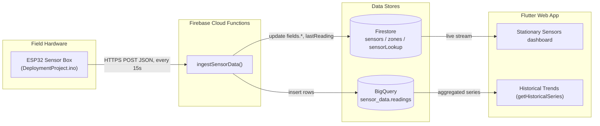
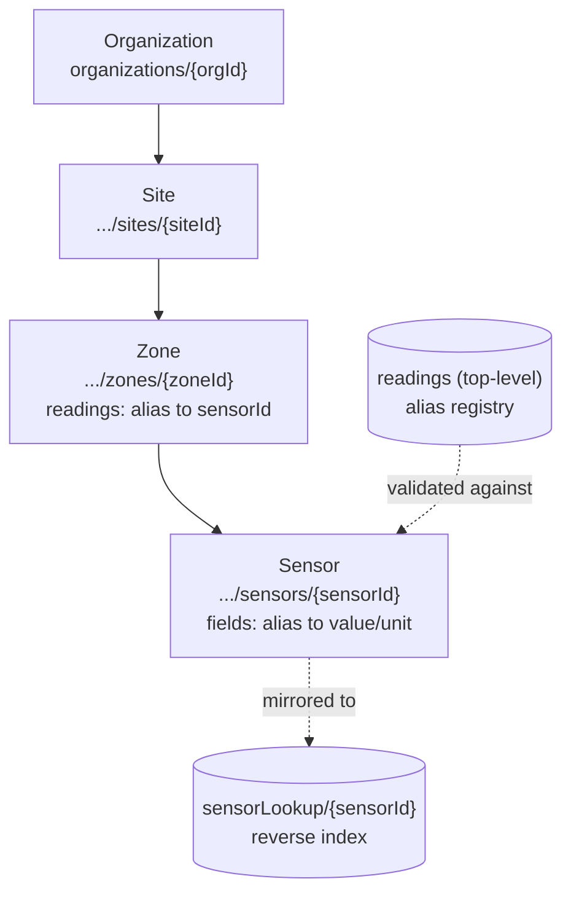
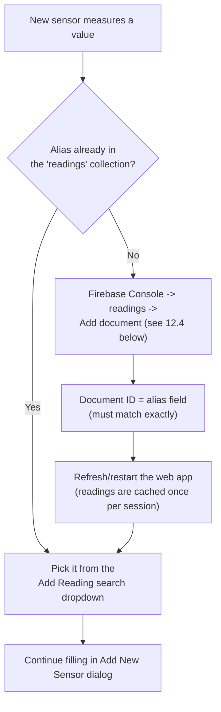
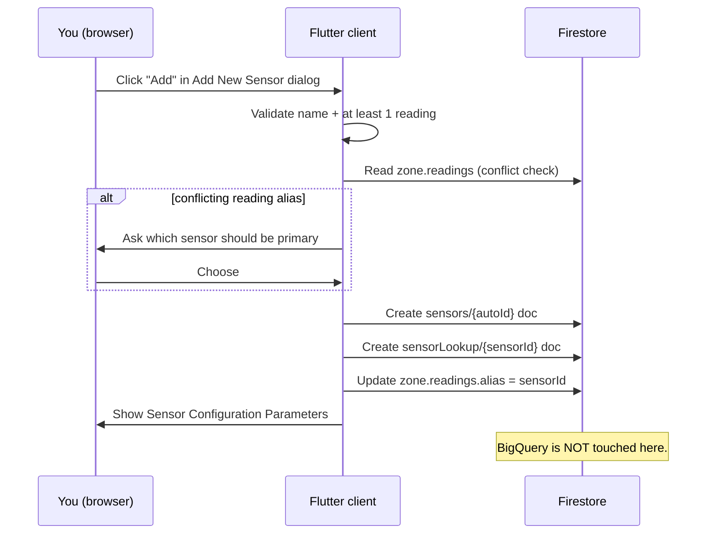
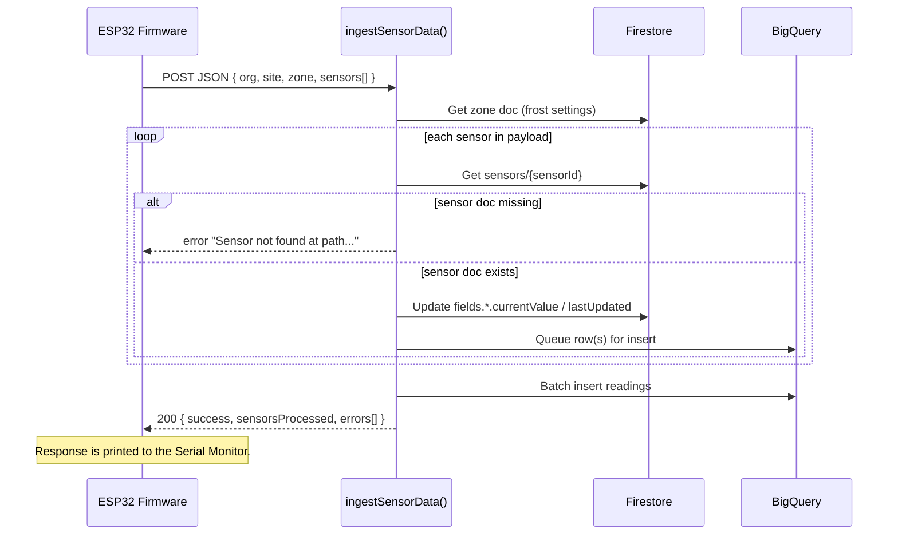
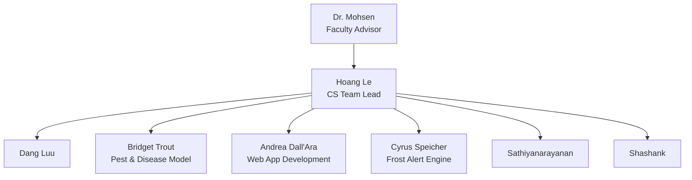

# Agrivoltaics Project Handbook

Last updated: 2026-09-22

> This is the single consolidated reference for the Agrivoltaics platform, merging the
> former Applicable-Software, Backlog-Handover, DataModel, Developer-Handoff,
> LocalDevSetup, Sensor-Onboarding-Guide, StationarySensors, and UIFeatures docs. Those
> originals are preserved for history under [docs/archive/](archive/). **If this guide
> conflicts with code, the code is authoritative.**

## Table of Contents

1. [System Summary](#1-system-summary)
2. [Canonical Software & Access](#2-canonical-software--access)
3. [Repository Map](#3-repository-map)
4. [Runtime Architecture](#4-runtime-architecture)
5. [Firestore Data Model](#5-firestore-data-model)
6. [BigQuery Data Model](#6-bigquery-data-model)
7. [Cloud Function APIs](#7-cloud-function-apis)
8. [Flutter App Internals](#8-flutter-app-internals)
9. [UI Feature Spec](#9-ui-feature-spec)
10. [Development Environment Setup](#10-development-environment-setup)
11. [Local Dev Against the Firestore Emulator](#11-local-dev-against-the-firestore-emulator)
12. [Sensor Onboarding & Firmware Deployment](#12-sensor-onboarding--firmware-deployment)
13. [Stationary Sensor Hardware Reference](#13-stationary-sensor-hardware-reference)
14. [Configuration and Secrets](#14-configuration-and-secrets)
15. [Deployment and Operations](#15-deployment-and-operations)
16. [Security and Access Notes](#16-security-and-access-notes)
17. [Known Issues and Technical Debt](#17-known-issues-and-technical-debt)
18. [Outstanding Backlog](#18-outstanding-backlog)
19. [Handoff Checklist & Quick Reference](#19-handoff-checklist--quick-reference)
20. [Project Team](#20-project-team)

---

## 1. System Summary

The system is a multi-component platform for vineyard monitoring and analytics:

- Flutter app for organization/site/zone/sensor management, dashboards, and alerts
- Firebase Auth + Firestore for identity, app state, and metadata
- Firebase Cloud Functions for ingestion, alert processing, and analytics APIs
- BigQuery as historical and analytical storage
- Pi-side pipeline and ML services for image capture and disease/pest workflows

High-level data flow:

1. Sensors send readings to the Cloud Function ingest endpoint.
2. The function updates Firestore current state and writes historical points to BigQuery.
3. Alert rules (including the six-level frost engine) are evaluated; in-app notifications and FCM pushes are generated.
4. The Flutter app renders real-time Firestore data + historical/frost timelines from BigQuery-backed APIs.

---

## 2. Canonical Software & Access

Canonical software supporting this application is **Firebase** and **Google Cloud**. Both
can be reached with the GrafanaInfluxDB Google account (`agrivoltaicsgrafana@gmail.com`),
whose credentials live in the shared Google Drive. Ideally every user logs in with their
own account down the road (see [Outstanding Backlog](#18-outstanding-backlog)).

**Firebase** — important parts: FireStore, Authentication, Cloud Functions, Storage.

**Google Cloud** — important part: BigQuery. Google Cloud also hosts the web app:

- https://vinovoltaics-webapp-593883469296.us-east4.run.app/

To access the web app, your email must be in the `AUTHORIZED_EMAILS` whitelist
environment variable, deployed via the GitHub CD pipeline.

**Project** (both Firebase and Google Cloud): `agrivoltaics-flutter-firebase`

**GitHub** (source control, all developers need access): https://github.com/Voltaics/agrivoltaics

---

## 3. Repository Map

Top-level repository includes active code plus historical/legacy artifacts. Use this map
when deciding where to work.

### 3.1 Core active paths

- `application/agrivoltaics_flutter_app`: main Flutter client
- `functions`: Firebase Cloud Functions (Node.js)
- `docs`: architecture and data model docs
- `application/pi_code`: Raspberry Pi capture and upload pipeline
- `application/pest_detection_backend`: FastAPI pest classifier service

### 3.2 Additional paths (Legacy/Support)

- Legacy: `application/microservices/py-weather-api`
- Legacy: `application/microservices/py-weather-microservice`
- Support: `application/model_training`
- Legacy: `application/flutter_demo_app`, `application/flutter_sample_app`, `migration_temp_app`
- Legacy: `docker_app`
- Support: `assignments`

### 3.3 Ownership boundaries (recommended)

For continuity, assign explicit maintainers:

- Mobile/Web app team: `application/agrivoltaics_flutter_app`
- Backend/data team: `functions` + BigQuery schema and operations
- Edge/vision team: `application/pi_code` + `application/pest_detection_backend` + `model_training`
- Documentation/integration owner: `docs` and API contracts

This reduces regression risk during multi-team handoff.

---

## 4. Runtime Architecture

### 4.1 Flutter client

Main app lives in `application/agrivoltaics_flutter_app`.

Key architecture:

- Entry: `lib/main.dart`
- Global state: Provider + ChangeNotifier in `lib/app_state.dart`
- Domain services: `lib/services/*` (Firestore access, alert APIs, historical APIs)
- Models: `lib/models/*`
- UI pages: `lib/pages/*`

Major app domains: authentication and organization selection, stationary dashboard
(site/zone/sensor management), historical dashboard (multi-series BigQuery-backed chart
data), alerts page (alert rule CRUD + notifications), mobile dashboard (capture
listing/details from the `captures` collection).

### 4.2 Firebase/Functions

Functions live in `functions` and export from `functions/index.js`:

- `ingestSensorData`
- `setupBigQuery`
- `getHistoricalSeries`
- `sendTestAlert`
- `getFrostPredictionSeries`

Infra config — `firebase.json` defines functions source and emulator ports:

- functions: 5001
- firestore: 8080
- emulator UI: 4000

### 4.3 Data stores

- Firestore: operational state, metadata, app collections (see [Section 5](#5-firestore-data-model))
- BigQuery dataset `sensor_data` (see [Section 6](#6-bigquery-data-model))

### 4.4 Auxiliary services

- Pi pipeline uploads captures and ML output to Firebase (`application/pi_code`)
- Pest detection backend (FastAPI, Torch) exposes `/pests_predict`
- Legacy weather services are Legacy — not part of the primary development workflow

---

## 5. Firestore Data Model

This section reflects the collections and fields currently used by the app and Cloud
Functions code — treat it as canonical for implementation decisions.

### 5.1 `users` (top-level)

Document ID: Firebase Auth UID

```javascript
users/{userId}
{
  uid: string,
  email: string,                    // normalized lowercase
  displayName: string,

  createdAt: timestamp,
  lastLogin: timestamp,

  // Legacy single-token path (still referenced in model/service)
  fcmToken?: string | null,
  fcmTokenUpdatedAt?: timestamp,

  // Current multi-device token storage
  fcmTokens?: string[],
}
```

### 5.2 `organizations` (top-level)

```javascript
organizations/{orgId}
{
  name: string,
  description: string,
  logoUrl?: string | null,

  createdAt: timestamp,
  updatedAt: timestamp,
  createdBy: string,                // userId
}
```

#### 5.2a `organizations/{orgId}/members`

Document ID: userId

```javascript
organizations/{orgId}/members/{userId}
{
  email?: string,                   // normalized email (set for invited/added members)
  role: string,                     // "owner" | "admin" | "member" | "viewer"
  permissions: {
    canManageMembers: boolean,
    canManageSites: boolean,
    canManageSensors: boolean,
  },

  joinedAt: timestamp,
  invitedBy: string | null,         // userId
  lastActive: timestamp | null,
}
```

#### 5.2b `organizations/{orgId}/pendingInvites`

Used for invite-by-email before the target user signs in. Document ID: normalized email
(with `/` replaced).

```javascript
organizations/{orgId}/pendingInvites/{inviteDocId}
{
  orgId: string,
  email: string,                    // normalized lowercase
  emailOriginal: string,

  role: string,
  permissions: {
    canManageMembers: boolean,
    canManageSites: boolean,
    canManageSensors: boolean,
  },

  status: string,                   // "pending" | "accepted"
  invitedBy: string,
  createdAt: timestamp,
  updatedAt: timestamp,
  acceptedAt?: timestamp,
}
```

#### 5.2c `organizations/{orgId}/sites`

```javascript
organizations/{orgId}/sites/{siteId}
{
  name: string,
  description: string,

  location?: geopoint,
  address: string,
  timezone: string,

  lastDataReceived?: timestamp | null,

  createdAt: timestamp,
  updatedAt: timestamp,
  createdBy: string,

  siteChecked: boolean,
}
```

#### 5.2d `organizations/{orgId}/sites/{siteId}/zones`

```javascript
organizations/{orgId}/sites/{siteId}/zones/{zoneId}
{
  name: string,
  description: string,
  location?: geopoint,

  zoneChecked: boolean,

  // Dynamic map: reading field alias -> sensorId
  readings: {
    [readingFieldName: string]: string,
  },

  createdAt: timestamp,
  updatedAt: timestamp,

  // Optional frost settings used by ingest/trigger logic
  frostSettings?: {
    enabled?: boolean,
    predStart?: timestamp,
    predEnd?: timestamp,
    tempThresholdF?: number,
  }
}
```

#### 5.2e `organizations/{orgId}/sites/{siteId}/zones/{zoneId}/sensors`

```javascript
organizations/{orgId}/sites/{siteId}/zones/{zoneId}/sensors/{sensorId}
{
  name: string,
  model: string,                    // e.g. DHT22, VEML7700, DFRobot-Soil, SGP30
  location?: geopoint,

  fields: {
    [fieldName: string]: {
      currentValue?: number,
      unit: string,
      lastUpdated?: timestamp,
    }
  },

  lastReading?: timestamp,
  createdAt: timestamp,
  updatedAt: timestamp,
}
```

#### 5.2f `organizations/{orgId}/alertRules`

```javascript
organizations/{orgId}/alertRules/{ruleId}
{
  id: string,
  name: string,

  ruleType: string,                 // "threshold" | "frost_warning" | "mold_risk" | "black_rot_risk"
  fieldAlias: string,               // for threshold rules
  operator?: string | null,         // "gt" | "lt" | "gte" | "lte" | "eq"
  threshold?: number | null,

  // Structured conditions for non-threshold rules
  ruleConfig?: map | null,

  // Backward-compat key still written by UI for frost rules
  frostConfig?: map | null,

  enabled: boolean,
  notifyUserIds: string[],

  activeRangeStart?: string | null, // "MM/dd"
  activeRangeEnd?: string | null,   // "MM/dd"
  cooldownMinutes: number,
  lastFiredAt?: timestamp,

  // Function-side optional knobs
  inAppEnabled?: boolean,
  inAppExpiresAfterHours?: number,

  createdBy: string,
  createdAt: timestamp,
  updatedAt: timestamp,
}
```

#### 5.2g `organizations/{orgId}/sites/{siteId}/zones/{zoneId}/frostRunLock`

Internal lease document used by Cloud Functions to prevent overlapping frost runs.

```javascript
organizations/{orgId}/sites/{siteId}/zones/{zoneId}/frostRunLock/lease
{
  expiresAt: timestamp,
  updatedAt: timestamp,
}
```

#### 5.2h `frostRuleConfig` — the six-level frost alert engine

`frostRuleConfig` is a **sibling** map on the zone doc (5.2d), never overloading
`frostSettings` (5.2d) — that map is read by `parseFrostSettings`/`shouldTriggerFrostJob`
in `functions/handlers/ingestSensorData.js` to gate the *unrelated* AI-model Cloud Tasks
trigger. `frostRuleConfig` instead drives the independent, stateful engine in
`functions/lib/frostEngine/` (evaluated on ingest, throttled to ~15 min) and is edited
from the Flutter app via `FrostEngineConfigService`/`FrostEngineConfigDialog`. Every
threshold below falls back to a spec-faithful default (`FrostRuleConfig.defaults()` in
`lib/models/frost_rule_config.dart`, mirrored server-side by `defaultIfNull(config.*, ...)`
calls in `functions/lib/frostEngine/{derivations,rules,evaluateZoneFrostEngine}.js`) if
unset, so a zone with no `frostRuleConfig` at all is inert (`enabled` defaults to `false`).

```javascript
organizations/{orgId}/sites/{siteId}/zones/{zoneId}
{
  // ...fields from 5.2d...

  frostRuleConfig?: {
    enabled: boolean,                  // default false — opt-in per zone
    growthStage: string,               // dormant|swollenBud|budBreak|shoot1to3in|flowering|fruitSet
    cultivar: string,
    criticalTempF: number,
    minExposureDurationMinutes: number,
    eventMarginF: number,
    allClearMarginF: number,
    allClearStableMinutes: number,
    allClearForecastWindowHours: number,
    allClearHoldMinutes: number,
    warningMinConsecutiveReadings: number,

    windCalmMaxMph: number,
    windLightMaxMph: number,
    windModerateMaxMph: number,
    leafWetnessDryMaxPercent: number,
    leafWetnessWetMinPercent: number,

    watch2A_airTempMaxF: number,
    watch2A_coolingRateMinFPerHr: number,
    watch2A_windMaxMph: number,
    watch2A_dewSpreadMinF: number,
    watch2B_forecastHorizonHours: number,
    watch2B_referenceThresholdF: number,

    warn3A_airTempMaxF: number,
    warn3A_windMaxMph: number,
    warn3A_coolingRateMinFPerHr: number,
    warn3A_dewSpreadMaxF: number,
    warn3B_airTempMaxF: number,
    warn3B_windMaxMph: number,
    warn3B_coolingRateMinFPerHr: number,
    warn3B_dewSpreadMinF: number,
    warn3B_projected2hMaxF: number,
    warn3C_airTempMaxF: number,
    warn3C_windMinMph: number,

    imminent4A_airTempMaxF: number,
    imminent4A_minGrowthStage: string,
    imminent4B_airTempMaxF: number,
    imminent4B_dewSpreadMaxF: number,
    imminent4B_windMaxMph: number,

    nightLightMaxLux: number,
    frostSensitiveFromStage: string,

    notifyUserIds: string[],
    updatedAt: timestamp,
    updatedBy: string,
  }
}
```

`leafMoisture` (existing reading alias) is reused as the leaf-wetness sensor's raw
reading — no new `leafWetnessRaw` alias exists. `windGust` is not a registered reading
alias; rules that could use it (gust) simply come back empty.

##### `organizations/{orgId}/sites/{siteId}/zones/{zoneId}/frostConfigAudit`

One doc per **changed field**, written client-side in the same batched write as the
`frostRuleConfig` merge (no Cloud Function needed — same "direct Firestore write from
browser" pattern already used for sensor creation).

```javascript
organizations/{orgId}/sites/{siteId}/zones/{zoneId}/frostConfigAudit/{autoId}
{
  changedAt: timestamp,
  changedByUid: string,
  fieldKey: string,           // e.g. "criticalTempF", "notifyUserIds"
  previousValue: any,
  newValue: any,
  cultivarAtChange: string,
  growthStageAtChange: string,
}
```

### 5.3 `readings` (top-level)

Document ID: reading alias (camelCase)

```javascript
readings/{readingAlias}
{
  alias: string,
  name: string,
  description: string,
  validUnits: string[],
  defaultUnit: string,
}
```

### 5.4 `sensorLookup` (top-level)

Document ID: sensorId

```javascript
sensorLookup/{sensorId}
{
  sensorDocPath: string,
  organizationId: string,
  siteId: string,
  zoneId: string,
  sensorId: string,

  sensorModel: string,
  sensorName: string,
  fields: string[],

  lastDataReceived?: timestamp,
  registeredAt: timestamp,
  updatedAt: timestamp,
}
```

### 5.5 `notifications` (top-level)

In-app notification queue consumed by the app UI.

```javascript
notifications/{notificationId}
{
  userId: string,
  organizationId: string,

  title: string,
  body: string,
  type: string,                     // "alert" | "system" | etc.

  referenceType?: string,           // currently written as "alert" by functions
  referenceId?: string | null,

  isRead: boolean,
  readAt?: timestamp,

  createdAt: timestamp,
  expiresAt?: timestamp | null,
}
```

### 5.6 `captures` (top-level)

Written by the Pi/mobile capture pipeline and displayed on the mobile dashboard.

```javascript
captures/{captureId}
{
  timestamp: timestamp,
  url: string[],                    // storage paths or public URLs (pipeline-dependent)
  detected_disease: boolean,

  // Pipeline-dependent metadata
  analysis?: string | number,
  analysis_summary?: string,
}
```

### 5.7 Legacy or planned collections

The following were documented previously but are not currently referenced by the active
app/services code in this repository:

- `mobileSensors`
- `alerts` (top-level alert records are currently in BigQuery; in-app alerts are in `notifications`)
- `imageAnalysis`

---

## 6. BigQuery Data Model

Managed by `setupBigQuery` and function code.

Dataset: `sensor_data`

Tables:

- `readings` — partitioned by timestamp (day); clustered by `sensorId`, `field`
- `alerts` — partitioned by `triggeredAt`; clustered by `organizationId`, `ruleId`
- `frost_predictions` — consumed by `getFrostPredictionSeries`; creation/population is external to the current `setupBigQuery` implementation

---

## 7. Cloud Function APIs

### 7.1 `ingestSensorData`

Purpose: validate incoming sensor payload; update sensor field values in Firestore;
write rows to the BigQuery `readings` table; decide whether to enqueue a frost trigger
task (with a per-zone lease lock); evaluate alert rules and dispatch notifications.

Important behavior:

- validates sensor and reading structure
- checks reading aliases against the Firestore `readings` collection
- computes the `primarySensor` flag using the zone `readings` map
- uses Cloud Tasks for frost job orchestration
- runs alert checks non-fatally (ingest succeeds even if alerts fail)

### 7.2 `setupBigQuery`

Purpose: one-time or repeat-safe setup of dataset/tables and schema checks. Creates/verifies
`sensor_data.readings` and `sensor_data.alerts`.

### 7.3 `getHistoricalSeries`

Purpose: return aggregated historical graph-ready data.

Request fields include `organizationId`, `siteId`, `zoneIds`, `readings`, `start`, `end`,
and optionally `interval`, `sensorId`, `timezone`, `aggregation`.

Notes: authentication check is currently commented out (explicit TODO in code — see
[Security and Access Notes](#16-security-and-access-notes)); supports dynamic interval
selection and aggregation (AVG/MIN/MAX).

### 7.4 `getFrostPredictionSeries`

Purpose: return a bucketed timeline for a single zone including sensor context and
`predictedChance`. Depends on the `readings` table and the `frost_predictions` table.

### 7.5 `sendTestAlert`

Purpose: trigger a synthetic alert notification for a specific rule for verification.

Notes: requires a Firebase ID token; builds synthetic payloads by rule type (threshold,
frost_warning, mold_risk, black_rot_risk).

---

## 8. Flutter App Internals

### 8.1 State management

Global state in `AppState` includes: selected organization, site, zone; user profile
snapshot; date ranges and selections for historical and frost timelines; loaded
historical/frost responses and loading/error flags; some legacy structures retained for
migration compatibility.

### 8.2 Service layer

Core services and responsibilities:

- `user_service.dart`: user doc lifecycle + pending invite acceptance
- `organization_service.dart`: org CRUD, membership, invite workflow
- `site_service.dart`: site CRUD, nested deletion handling
- `zone_service.dart`: zone CRUD, primary sensor mapping
- `sensor_service.dart`: sensor CRUD + field updates + lookup sync
- `sensor_lookup_service.dart`: `sensorLookup` maintenance
- `readings_service.dart`: reading definitions cache
- `alert_service.dart`: alert rule CRUD under org
- `historical_series_service.dart`: client for historical API
- `frost_prediction_series_service.dart`: client for frost timeline API
- `fcm_service.dart`: token registration and refresh handling
- `frost_engine_config_service.dart` / `frost_engine_state_service.dart`: read/write `frostRuleConfig` and the frost engine's runtime state (see [Section 5.2h](#52h-frostruleconfig--the-six-level-frost-alert-engine))

### 8.3 Notifications path

In-app notifications are stored in the Firestore `notifications` collection. The UI
stream is in `pages/home/notifications.dart`. The read action sets `isRead` true and
`readAt` to a server timestamp.

### 8.4 Alerts flow

Alert rules are created in `organizations/{orgId}/alertRules`. Background alert checks
run in the ingest path. When triggered: rule `lastFiredAt` is updated; a BigQuery
`alerts` event is written; in-app notifications are created; FCM multicast is attempted
for each token; invalid tokens are pruned from user docs.

---

## 9. UI Feature Spec

This section lays out the features the application must enable. Compatibility: each
feature must be implemented for desktop and mobile-sized screens — the Flutter app is
supported on web (small and large screens) as well as iOS and Android.

### 9.1 Authentication

The application uses Google authentication for user login, managed through Firebase.

### 9.2 Organizations

After logging in, users are directed to an organization selection page displaying only
organizations they have access to. Users can switch or manage organizations at any time
while logged in.

Available actions: sign out; select organization; create new organization; edit
organization (change organization data, manage organization members — add member,
change member permissions, remove member — and delete organization).

### 9.3 Sites

Once an organization is selected, users can choose a site to view stationary sensor
data. Only sites belonging to the selected organization are displayed.

Available actions: select site; add site; edit site (change site data, delete site).

### 9.4 Zones

Each site can have multiple zones assigned to it. Sites must have at least one zone to
track sensors, as zones manage sensor assignments. Zones are nested under sites in the
UI since each zone belongs to only one site.

Data filtering: selecting a site displays data from all its zones; selecting a specific
zone filters data to show only that zone's information.

Available actions: select zone; add zone; edit zone (change zone data, delete zone).

### 9.5 Stationary Sensors

Stationary sensors are assigned to zones. Users who prefer not to manage multiple zones
must still create at least one zone to represent the entire site.

Data display: sensors are filtered based on the selected site or zone; site-level
selection shows all sensors across all zones; zone-level selection shows only sensors
for that specific zone; individual readings are displayed to maintain sensor-agnostic
historical data; some sensors generate multiple readings, each mapping back to its
originating sensor.

Sensor management: add sensor; edit sensor; delete sensor (with constraints).

Deletion rules: sensors with stored readings cannot be permanently deleted to maintain
data integrity; such sensors can be soft-deleted (marked as offline and hidden from UI),
ensuring historical readings remain traceable to their source sensors.

#### 9.5.1 Sensor data visualization

- **Most Recent Reading:** stored with the entity for quick access
- **Historical Data:** displayed as interactive graphs, filterable by timeframe and
  other attributes; stored separately from real-time data (may have longer retrieval
  times); enables trend analysis over specified periods

### 9.6 Mobile Imaging

Mobile imaging is implemented through the captures workflow.

Current capabilities: view captures from the Firestore `captures` collection; filter
between all captures and disease-flagged captures; open capture detail views for
processed imagery.

Notes: capture ingestion/upload pipeline is handled by the Pi-side workflow; image URLs
may be storage paths or public URLs depending on pipeline configuration.

---

## 10. Development Environment Setup

### 10.1 Prerequisites

Install: Flutter SDK (matching repository app constraints; Dart `>=3.0.0 <4.0.0` in
pubspec — see [Section 11.2](#112-install-the-flutter-sdk--pinned-version-not-stable)
for the exact pinned version), Node.js 20 for functions, Firebase CLI, Python 3.10 for
Python services, Google Cloud SDK (for some BigQuery/admin workflows).

### 10.2 Firebase access

You need project access for: Firebase Auth, Firestore, Cloud Functions, BigQuery, Cloud
Storage, Cloud Tasks (for the frost trigger queue flow).

### 10.3 Flutter setup

From `application/agrivoltaics_flutter_app`:

```bash
flutter pub get
flutter run -d chrome
```

Optional quality checks:

```bash
flutter analyze
flutter test
```

### 10.4 Functions setup

From `functions`:

```bash
npm install
npm run lint
npm run serve
```

Deploy:

```bash
npm run deploy
```

### 10.5 Python services setup

**Pest detection backend** — from `application/pest_detection_backend`:

```bash
pip install -r requirements.txt
uvicorn main:app --host 0.0.0.0 --port 8080
```

**Weather microservice** — Legacy. Do not use as part of the primary development
workflow.

**Pi pipeline** — from `application/pi_code`, run the pipeline entry script:

```bash
python start_pipeline.py --mode single
# or
python start_pipeline.py --mode continuous
```

Note: script path assumptions are hardcoded for specific filesystem locations; adjust
before production use on new hardware.

### 10.6 Local development workflows

Recommended day-to-day loop:

1. Start Firebase emulators for functions/firestore where needed (see [Section 11](#11-local-dev-against-the-firestore-emulator) for a full disposable-database setup).
2. Run the Flutter app locally (usually the web target for quick UI iteration).
3. Use test payloads/scripts for ingestion and historical endpoints.
4. Use `sendTestAlert` to validate rule notification behavior.

**Mock data for analytics UI:** use `functions/utils/load_mock_data.py` to seed
historical BigQuery data. This is valuable for frontend chart development without
hardware dependencies.

**API smoke test commands** — ingest example shape:

```json
{
  "organizationId": "ORG",
  "siteId": "SITE",
  "zoneId": "ZONE",
  "sensors": [
    {
      "sensorId": "SENSOR",
      "timestamp": 1710000000,
      "readings": {
        "temperature": {"value": 72.5, "unit": "F"}
      }
    }
  ]
}
```

Historical endpoint example shape:

```json
{
  "organizationId": "ORG",
  "siteId": "SITE",
  "zoneIds": ["ZONE"],
  "readings": ["temperature"],
  "start": "2026-04-01T00:00:00Z",
  "end": "2026-04-08T00:00:00Z",
  "aggregation": "AVG"
}
```

---

## 11. Local Dev Against the Firestore Emulator

How to set up a Windows machine from scratch to run the Flutter app
(`application/agrivoltaics_flutter_app`) locally against a **disposable local Firestore
database**, so you can freely create/break test orgs, members, and invites without
touching production data. Firebase Auth still uses the real project — you sign in with a
real Google account — only Firestore reads/writes are redirected locally.

This is a one-time setup per machine. Once done, day-to-day use is just
`scripts\start-local-dev.ps1` / `scripts\stop-local-dev.ps1`.

### 11.1 Prerequisites you probably already have

- **Node.js + npm** (`node --version`, `npm --version`). If missing, install from nodejs.org.
- **Git**.

### 11.2 Install the Flutter SDK — pinned version, not `stable`

This project's dependency lockfile (`pubspec.lock`) resolves against older transitive
package versions than the current Flutter `stable` channel. If you clone the latest
`stable` branch, `flutter run` will fail to compile with errors like:

```
Error: The class 'IconData' can't be extended outside of its library because it's a final class.
```

This comes from `material_design_icons_flutter` / `font_awesome_flutter` subclassing
`IconData`, which a newer Dart SDK forbids. **Use Flutter 3.38.10** instead (matches this
project's `pubspec.lock` `sdks:` constraint, `flutter: >=3.38.0`):

```powershell
git clone https://github.com/flutter/flutter.git -b 3.38.10 C:\Workspace\UC\Research_Summer2026\flutter
```

(Pick any local path without spaces; adjust the commands below if you use a different one.)

Add it to your **User** PATH permanently:

```powershell
$userPath = [Environment]::GetEnvironmentVariable("PATH", "User")
[Environment]::SetEnvironmentVariable("PATH", "$userPath;C:\Workspace\UC\Research_Summer2026\flutter\bin", "User")
```

Open a **new** terminal (PATH changes don't apply to already-open shells), then verify:

```powershell
flutter --version
# Should print: Flutter 3.38.10 ...
```

> If a future `pubspec.lock` update raises the `flutter:` floor past 3.38.x, or if you
> hit the `IconData` error again on a newer SDK, check `pubspec.lock`'s `sdks:` block and
> pick a nearby tag with `git checkout <tag>` inside the cloned Flutter repo instead of
> re-cloning.

### 11.3 Install Java (required by the Firestore emulator)

The Firestore emulator is a Java process; Flutter/Firebase tooling itself doesn't need
Java, but `firebase emulators:start` does.

```powershell
winget install Microsoft.OpenJDK.21 --accept-package-agreements --accept-source-agreements
```

Add it to your **User** PATH permanently (adjust the version folder name if different):

```powershell
$userPath = [Environment]::GetEnvironmentVariable("PATH", "User")
[Environment]::SetEnvironmentVariable("PATH", "$userPath;C:\Program Files\Microsoft\jdk-21.0.11.10-hotspot\bin", "User")
```

Open a **new** terminal and verify: `java -version`.

### 11.4 Enable Windows Developer Mode

Flutter's build tooling needs symlink support, which Windows only allows without admin
elevation when Developer Mode is on.

```powershell
start ms-settings:developers
```

Toggle **Developer Mode** on in the window that opens.

### 11.5 Install project dependencies

From the **repo root** (this installs the Firebase CLI locally into `node_modules` —
deliberately *not* global, so it's version-pinned per-project):

```powershell
npm install
```

From the **Flutter app directory**:

```powershell
cd application\agrivoltaics_flutter_app
flutter pub get
```

### 11.6 Verify everything

```powershell
cd application\agrivoltaics_flutter_app
flutter analyze   # should show only pre-existing lint notes, no errors
flutter doctor -v # Chrome may be missing — that's fine, we use Edge; Android/Windows-desktop toolchain warnings are irrelevant, we only target web
```

Flutter should list **Edge (web)** as a connected device even without Chrome installed —
this app's Google Sign-In currently only implements the web flow anyway (`lib/auth.dart`'s
native-mobile path is commented out), so Edge/Chrome is the only practical way to run it
locally.

### 11.7 Running the local stack day-to-day

Once the above is done once, use the scripts:

```powershell
# Start (prompts for which email(s) to authorize, e.g. your own Google account)
scripts\start-local-dev.ps1

# or non-interactively:
scripts\start-local-dev.ps1 -AuthorizedEmails "you@gmail.com,teammate@gmail.com"

# or with a test org auto-seeded and owned by you (see "Seeding a test org" below):
scripts\start-local-dev.ps1 you@gmail.com "My Test Org"
```

This opens two windows:

- **Firestore emulator** — data browser/editor at http://127.0.0.1:4000
- **Flutter app** — launches in Edge automatically; this window supports Flutter's
  normal hot-reload keys (`r` = hot reload, `R` = hot restart, `q` = quit)

Sign in with a real Google account whose email you passed to `-AuthorizedEmails`. All
Firestore reads/writes go to the local emulator; nothing touches production.

When done:

```powershell
scripts\stop-local-dev.ps1
```

This kills both windows and their child processes cleanly. Restarting the emulator
always starts from an **empty** database — nothing persists between runs.

### 11.8 Seeding a test org (working around the hardcoded org-creation gate)

`AppConstants.canCreateOrganizationForUser` in `lib/app_constants.dart` only allows a
single specific UID/email to create organizations through the app's own UI. This is a
hardcoded check, not driven by Firestore data or dart-defines, so it can't be worked
around via `AUTHORIZED_EMAILS` or emulator data alone.

`start-local-dev.ps1` can seed a test org for you instead, bypassing that gate entirely
(it writes straight to the local emulator, not through the app):

```powershell
scripts\start-local-dev.ps1 <your-email> ["Org Name"]
```

This requires credentials for the real project (separate from `firebase login`). Two
ways to get them — **use the service account key** unless you have a specific reason not
to; it's simpler and doesn't depend on your personal Google account's IAM permissions on
the GCP project (which may not be set up even if you can see the project fine in the
Firebase console).

**Option A — service account key (recommended), one-time setup:**

1. Firebase Console → **agrivoltaics-flutter-firebase** → gear icon → **Project
   Settings** → **Service Accounts** tab → **Generate new private key**.
2. Save the downloaded file as `secrets/agrivoltaics-admin-key.json` in this repo. That
   folder is gitignored (see `secrets/README.md`) — the key never gets committed.
3. Before running the script, in the same terminal:
   ```powershell
   $env:GOOGLE_APPLICATION_CREDENTIALS = "secrets\agrivoltaics-admin-key.json"
   ```
   (Set this once per terminal session — it doesn't persist across terminals unless you
   add it to your PowerShell profile.)

This key is a real, long-lived credential with broad Admin SDK access — treat it like a
password. If you ever suspect it leaked, revoke it from the same Service Accounts page
and generate a new one.

**Option B — Application Default Credentials via gcloud**, if you'd rather not download
a key file. *Not* an npm package (`npx gcloud ...` won't work — it's the standalone
Google Cloud SDK CLI):

```powershell
winget install Google.CloudSDK --accept-package-agreements --accept-source-agreements
```

Open a **new** terminal, then:

```powershell
gcloud auth application-default login
```

This can fail with a `PERMISSION_DENIED` / `USER_PROJECT_DENIED` error if your personal
Google account isn't granted the `serviceusage.serviceUsageConsumer` role (or broader) on
the `agrivoltaics-flutter-firebase` GCP project — the error message includes a console
link to grant it. If you hit that, Option A avoids the issue entirely.

What it does: looks up your email's real Firebase Auth account (creates one via the
Admin SDK if you've never signed in before — Auth stays real per this doc's design, only
Firestore is emulated), then seeds an `organizations/{id}` doc plus an owner
`members/{uid}` doc for that account directly into the local emulator. Sign in with that
same email in the browser and you'll land in the seeded org.

If seeding fails (e.g. ADC not set up), the script warns and still starts the app — you
can retry standalone with `node scripts\seed-test-org.js <email> ["Org Name"]` once the
emulator is running, no restart needed. The old manual-edit-and-revert workaround
(temporarily editing `canCreateOrganizationForUser`) still works too if you'd rather do
that for some reason, but shouldn't be necessary anymore.

### 11.9 Other known local-testing limitations

- **Testing a second "pending member"** (an authorized email that hasn't joined any org)
  requires either a second real Google account signed into a separate browser
  profile/incognito window (simplest, and what we did to verify this), or manually
  creating a `users/{fakeUid}` document in the Emulator UI with the right `email` field.
- The emulator UI lets you inspect/edit any document directly — useful for seeding edge
  cases without going through the app's UI at all.

### 11.10 Known pre-existing issue you may hit

`OrganizationService.createOrganization()` didn't originally write an `email` field onto
the creating owner's own membership document (only the invite-based `addMember()` path
did) — this was fixed in code, but **existing production organizations created before
the fix may still be missing that field** on their owner's membership doc, which would
make them undercounted in anything that queries membership by email (e.g. the Member
Directory page). A one-time production backfill may be worth doing separately.

---

## 12. Sensor Onboarding & Firmware Deployment

Audience: whoever is registering a new physical sensor (electrical/firmware team) and
whoever administers the web app (org owner/admin). For hardware specs and part numbers,
see [Section 13](#13-stationary-sensor-hardware-reference).

This walks through the complete path from "we have a new physical sensor" to "its
readings show up on the dashboard": registering it in the web app, defining new reading
types if needed, understanding what happens in Firestore/BigQuery under the hood, and
editing/flashing the Arduino firmware.

### 12.1 System overview

Every sensor reading takes the same path from hardware to dashboard:



Two things only work if they're set up **before** firmware goes live:

1. A Firestore **sensor document** must already exist for every `sensorId` the firmware
   sends — `ingestSensorData` looks it up and fails with `"Sensor not found at path..."`
   if it doesn't.
2. Every reading field name (`temperature`, `soilMoisture`, etc.) the firmware sends
   should already be a registered **reading alias** — otherwise the app can't display it
   with a friendly name or the right unit picker.

### 12.2 Data hierarchy



- **Organization / Site / Zone / Sensor IDs** are all Firestore auto-generated document
  IDs — nobody invents them, they're generated when the doc is created in the app and
  then copied into firmware.
- A **zone's `readings` map** (`{alias: sensorId}`) decides which sensor is treated as
  the "primary" source for a given measurement type — this is what actually drives the
  dashboard tiles and historical charts. A zone can have multiple sensors reporting the
  same alias, but only one is primary at a time.
- The top-level **`readings`** collection is the registry of valid measurement types
  (alias, display name, description, valid units, default unit). It has no in-app editor
  — see [Section 12.4](#124-if-the-reading-type-doesnt-exist-yet).
- **`sensorLookup`** is a denormalized reverse index (sensorId → org/site/zone path) used
  for fast lookups without walking the nested collection path.

### 12.3 Register a sensor from the web app

#### 12.3.1 Select the zone

The site/zone picker is the pill at the top of the page (📍 icon, e.g. "Vineyard"),
**not** a dropdown as the in-app help text currently (inaccurately) describes:

1. Click the site/zone pill.
2. In the "Select Location" sheet, click the **expand arrow** on the site row (not the
   row itself, not the pencil icon) to reveal its zones.
3. Click the specific zone. The pill now reads `Site › Zone`, and the gear icon (Sensor
   Configuration) will open instead of showing "select a zone" snackbar.

#### 12.3.2 Open the Add Sensor dialog

Click the gear icon → the Sensor Configuration dialog opens for that zone → click the
**+** icon → "Add New Sensor" dialog opens.

#### 12.3.3 Fill in the sensor

- **Sensor Name** (required)
- **Sensor Model** (optional, free text — e.g. `DHT22`)
- **Location** (optional lat/long)
- **Readings** — click **+** next to "Readings," search/select a reading alias, then
  pick its unit. Repeat for every measurement this physical sensor reports (e.g. a DHT22
  needs both `temperature` and `humidity`).

#### 12.4 If the reading type doesn't exist yet



There is no in-app way to create a new reading type — the search dropdown only lists
what's already in Firestore. To add one:

1. Firebase Console → Firestore Database → top-level **`readings`** collection → **Add
   document**.
2. **Document ID**: the new alias in camelCase, e.g. `windSpeed`.
3. Fields:

   | field | type | example |
   |---|---|---|
   | `alias` | string | `windSpeed` — **must exactly match the Document ID** |
   | `name` | string | `Wind Speed` |
   | `description` | string | `Wind speed at sensor mast` |
   | `validUnits` | array\<string\> | `["mph", "km/h"]` |
   | `defaultUnit` | string | `mph` |

4. Save, then refresh/restart the web app (the reading list is loaded once per session
   and cached), and the new alias will appear in the search dropdown.

> **Why the Document ID must equal the `alias` field:** the Flutter app caches readings
> keyed by the `alias` *field value*, but `ingestSensorData` (the Cloud Function)
> validates incoming data against the Firestore **document ID**. If these two ever
> differ, the Cloud Function will log `"Warning: Reading alias '...' not found in
> readings collection"` on every ingest for that field, even though the app UI works
> fine. Keep them identical.

#### 12.3.5 Click Add

If any reading you're adding conflicts with an existing sensor already marked primary
for that alias in the zone, a dialog asks which sensor should be primary going forward.
Resolve it, and the sensor is created.

A **"Sensor Configuration Parameters"** dialog then shows the **Organization ID / Site ID
/ Zone ID / Sensor ID** — copy all four; you'll need them for the firmware.

### 12.5 What happens in the background when you click "Add"

Everything here is a **direct Firestore write from the browser** — no Cloud Function
runs, and BigQuery is not touched at all yet.



1. **`sensors/{autoId}`** created under the zone, with `fields.{alias}` starting at
   `currentValue: null` — populated only once real data arrives.
2. **`sensorLookup/{sensorId}`** created at the top level, mirroring org/site/zone/sensor
   path + field list, for fast reverse lookups.
3. **`zone.readings.{alias}`** patched to point at the new sensor, if it won the
   primary/conflict resolution — this is what makes the reading show up as a dashboard
   tile.

### 12.6 Update and deploy the firmware

#### 12.6.1 Edit `DeploymentProject.ino`

For each new sensor registered above, add (mirroring the existing pattern in the file):

1. **A sensor ID constant** — the value copied from Section 12.3.5:
   ```cpp
   const char* SENSOR_ID_WIND = "the-sensor-id-from-the-app-dialog";
   ```
2. **Reading alias constants** — only if new, and must match the alias exactly:
   ```cpp
   const char* READING_WIND_SPEED = "windSpeed";
   ```
3. **Unit constants**, if new.
4. **Actual sensor-read code** — a variable plus driver/read logic in `loop()`, same as
   the existing DHT/SGP30/VEML7700/Modbus reads. This is the real wiring/electrical work.
5. **A new JSON block** inside the `sensors` array in `sendDataToCloud()`, following the
   existing pattern exactly:
   ```cpp
   jsonPayload += ",{";
   jsonPayload += "\"sensorId\":\"" + String(SENSOR_ID_WIND) + "\",";
   jsonPayload += "\"timestamp\":" + String(timestamp) + ",";
   jsonPayload += "\"readings\":{";
   jsonPayload += "\"" + String(READING_WIND_SPEED) + "\":{\"value\":" + String(windSpeed, 1) + ",\"unit\":\"mph\"}";
   jsonPayload += "}";
   jsonPayload += "}";
   ```
   The payload is built by raw string concatenation — **commas between sensor objects
   are easy to get wrong**. If your new block isn't the last one, it needs a trailing
   comma; if it *is* the last one, the block before it needs the trailing comma instead
   (and nothing after your new block).

If the new sensor is wired into an *existing* physical box, edit that box's `.ino`
directly. If it's a brand-new physical box at a different location, you're working from
a copy of this file with its own `ORGANIZATION_ID` / `SITE_ID` / `ZONE_ID` and sensor
IDs.

#### 12.6.2 What happens on the server when firmware sends data



#### 12.6.3 Flash it to the board

"Deploying" firmware means physically writing the compiled code onto the ESP32 over USB
— not a cloud deploy:

1. Open `DeploymentProject.ino` in the **Arduino IDE**.
2. Confirm required libraries are installed: `Adafruit SGP30`, `Adafruit VEML7700`, `DHT
   sensor library`, `ModbusMaster`.
3. Plug the ESP32 box in via USB.
4. **Tools → Board** → select the correct ESP32 board variant.
5. **Tools → Port** → select the box's COM port.
6. Click **Verify** to compile and catch syntax errors first.
7. Click **Upload** to flash the binary onto the board (it reboots running the new
   code).
8. Open the **Serial Monitor** at **115200 baud**. Every 15 seconds you'll see the exact
   JSON payload sent and the cloud's response (`Cloud response code:` / `Cloud
   response:`). This is your live feedback loop — a `"Sensor not found at path..."`
   response means Section 12.3 wasn't completed (or the wrong ID was copied) before
   flashing.
9. Once you see HTTP `200` and `"success":true`, the box is live. Unplug from USB and
   mount it in the field — it only needs power + WiFi from then on.

**Always complete Section 12.3 (register the sensor in the app) before flashing new
sensor IDs into firmware.** Doing it in the other order means every POST from the new
sensor block fails until the app-side doc exists — harder to debug live in the field
than at a desk.

### 12.7 Troubleshooting quick reference

| Symptom | Cause | Fix |
|---|---|---|
| Gear icon shows "select a specific Zone" snackbar | No zone selected — the site/zone pill was mistaken for read-only text | Click the pill, expand the site, click a zone (Section 12.3.1) |
| Serial Monitor shows `"Sensor not found at path..."` | Firmware has a `sensorId` with no matching Firestore doc | Complete Section 12.3 for that sensor before flashing, and double check the copied ID |
| Cloud Function logs `Warning: Reading alias '...' not found` | The `readings` doc's ID doesn't match its own `alias` field | Fix the doc so Document ID == `alias` field (Section 12.4) |
| New reading type doesn't show up in the Add Reading search | Web app cached the `readings` collection before you added the new doc | Refresh/restart the app |
| Malformed JSON / 400 from `ingestSensorData` | Comma placement wrong when adding a new sensor block in `.ino` | Recheck trailing commas between objects in the `sensors` array (Section 12.6.1) |
| Sensor tile shows "Sensor not found" or "Reading not available" on dashboard | Zone's `readings.{alias}` points at a sensor that doesn't exist, or that sensor has no data for that field yet | Confirm `zone.readings` mapping and that firmware has successfully POSTed at least once |

### 12.8 Reference: where this logic lives in code

| Concern | File |
|---|---|
| Sensor creation (Firestore writes) | `application/agrivoltaics_flutter_app/lib/services/sensor_service.dart` |
| Add Sensor dialog UI | `application/agrivoltaics_flutter_app/lib/pages/stationary_dashboard/dialogs/add_sensor_dialog.dart` |
| Sensor config params dialog (ID display) | `application/agrivoltaics_flutter_app/lib/pages/stationary_dashboard/dialogs/sensor_config_params_dialog.dart` |
| Reading alias cache | `application/agrivoltaics_flutter_app/lib/services/readings_service.dart` |
| Zone primary-sensor mapping | `application/agrivoltaics_flutter_app/lib/services/zone_service.dart` |
| Site/zone selector | `application/agrivoltaics_flutter_app/lib/pages/home/site_zone_breadcrumb.dart` |
| Ingest Cloud Function | `functions/handlers/ingestSensorData.js` |
| BigQuery table setup | `functions/handlers/setupBigQuery.js` |
| Firestore data model reference | [Section 5](#5-firestore-data-model) |
| Reference firmware | `application/arduino/DeploymentProject.ino` |
| Hardware part specs | [Section 13](#13-stationary-sensor-hardware-reference) |

---

## 13. Stationary Sensor Hardware Reference

Documentation for environmental monitoring sensors used in the agrivoltaics system for
measuring agricultural and atmospheric conditions.

| Sensor Type | Measurements | Interface |
|------------|--------------|-----------|
| DHT22 Temperature/Humidity | Temperature, Humidity | Digital |
| VEML7700 Light | Ambient Light | I2C |
| DFRobot Soil Sensor | Soil Temperature, Moisture, EC | RS485/MODBUS |
| SGP30 Gas | CO₂, TVOC | I2C |
| KY-016 RGB LED | RGB Light (indicator) | Digital |

### 13.1 Outdoor Temperature/Humidity Sensor (DHT22)

**Product:** Teyleten Robot DHT22 / AM2302 Digital Temperature Humidity Sensor Module for
Arduino
**Purchase Link:** [Amazon — DHT22 Sensor](https://www.amazon.com/Teyleten-Robot-Digital-Temperature-Humidity/dp/B0CPHQC9SF)

- **Temperature** — Range: -40°C to 80°C; Resolution: 0.1°C; Accuracy: ±0.5°C
- **Humidity** — Range: 0-100% RH; Resolution: 0.1% RH; Accuracy: ±2% RH

### 13.2 Ambient Light Sensor (VEML7700)

**Product:** 2 Pcs 16-bit I2C Interface VEML7700 Ambient Light Sensor Module for Arduino
**Purchase Link:** [Amazon — VEML7700 Sensor](https://www.amazon.com/GODIYMODULES-Interface-VEML7700-Ambient-Arduino/dp/B0DRRGVTLH)

- **Ambient Light** — Range: 0-120,000 lux; Interface: 16-bit I2C; Resolution: high
  precision ambient light detection

### 13.3 Soil Temperature/Moisture/EC Sensor

**Product:** RS485 MODBUS-RTU IP68 Soil Temperature & Moisture Sensor for Automatic
Irrigation
**Purchase Link:** [DFRobot — Soil Sensor](https://www.dfrobot.com/product-2816.html)

- **Soil Temperature** — Range: -40°C to 80°C; Resolution: 0.1°C; Accuracy: ±0.5°C
- **Soil Moisture** — Range: 0-100% RH; Resolution: 0.1% RH; Accuracy: ±2% RH (0-50%),
  ±3% RH (50-100%)
- **Soil Electrical Conductivity (EC)** — Range: 0-20,000 µs/cm; Resolution: 1 µs/cm;
  Accuracy: ±3% FS (0-10,000 µs/cm), ±5% FS (10,000-20,000 µs/cm); Temperature
  Compensation: 0-50°C (memory-based)

Features: IP68 waterproof rating; RS485/MODBUS-RTU interface; Arduino compatible.

### 13.4 Carbon Dioxide Sensor (SGP30)

**Product:** GY-SGP30 Gas Sensor, Air Quality CO₂ Formaldehyde Monitoring Module
**Purchase Link:** [Amazon — SGP30 Sensor](https://www.amazon.com/EC-Buying-Formaldehyde-Monitoring-Multi-Pixel/dp/B0B389LQCQ)

- **Carbon Dioxide (CO₂)** — measured in parts per million (PPM); digital multi-pixel gas
  sensor technology
- **Total Volatile Organic Compounds (TVOC)** — indoor air quality monitoring

Features: I2C interface; indoor air quality monitoring; Arduino compatible.

### 13.5 RGB Light Sensor/Indicator (KY-016)

**Product:** 3 Pack KY-016 Three Colors RGB LED Sensor Module DIY Starter Kit
**Purchase Link:** [Amazon — KY-016 RGB Module](https://www.amazon.com/KY-016-Colors-Sensor-Arduino-Starter/dp/B0786CQD5P)

RGB LED indicator module used for visual status indication, 3-color output (Red, Green,
Blue).

---

## 14. Configuration and Secrets

### 14.1 Flutter runtime environment variables

Defined through `String.fromEnvironment` in `lib/app_constants.dart`:

- `INFLUXDB_URL` (legacy)
- `INFLUXDB_TOKEN` (legacy)
- `INFLUXDB_ORG` (legacy)
- `INFLUXDB_BUCKET` (legacy)
- `INFLUXDB_DEBUG` (legacy)
- `AUTHORIZED_EMAILS` (used for whitelist)
- `TIMEZONE`
- `HISTORICAL_SERIES_ENDPOINT`
- `FROST_PREDICTION_SERIES_ENDPOINT`

Example:

```bash
flutter run -d chrome \
  --dart-define=HISTORICAL_SERIES_ENDPOINT=https://.../getHistoricalSeries \
  --dart-define=FROST_PREDICTION_SERIES_ENDPOINT=https://.../getFrostPredictionSeries
```

### 14.2 Firebase options

Client Firebase project settings are generated in `lib/firebase_options.dart`. Regenerate
with the FlutterFire CLI when project config changes.

### 14.3 Organization creation gate

Current app logic restricts org creation to a specific UID/email pair in
`lib/app_constants.dart` (see [Section 11.8](#118-seeding-a-test-org-working-around-the-hardcoded-org-creation-gate)
for the local-dev workaround). If this is no longer desired, remove or redesign this
gate.

### 14.4 Functions environment

No extensive runtime config is currently required for core handlers, but ensure service
account permissions for: Firestore read/write, BigQuery read/write, Cloud Tasks enqueue,
FCM send (Firebase Messaging).

---

## 15. Deployment and Operations

### 15.1 Firebase functions deployment

From `functions`:

```bash
npm run deploy
```

Predeploy lint is configured in `firebase.json`.

### 15.2 BigQuery setup runbook

After first deploy or infra reset:

1. Deploy functions.
2. Call the `setupBigQuery` endpoint.
3. Verify dataset/tables in the BigQuery console.

### 15.3 Monitoring and logs

Use Firebase functions log commands:

```bash
firebase functions:log
firebase functions:log --only ingestSensorData
```

Also monitor: BigQuery job errors and quota; Firestore write/read costs; Cloud Tasks
queue health for the frost job flow; FCM send failures and token churn.

---

## 16. Security and Access Notes

### 16.1 Current risk: historical endpoint auth

`getHistoricalSeries` has auth verification intentionally disabled in current code. This
should be prioritized before production hardening (see [Outstanding
Backlog](#18-outstanding-backlog)).

### 16.2 Token handling

Users may have both legacy `fcmToken` and active `fcmTokens` patterns. Standardize
around the array-based multi-device tokens.

### 16.3 Legacy Mongo services

Legacy. Not part of the primary development workflow.

---

## 17. Known Issues and Technical Debt

- Functions README references handlers that are not currently exported.
- Mixed legacy/new data patterns exist in app state and model fields.
- Absolute paths in Pi pipeline reduce portability.
- Multiple app folders can confuse onboarding; only one Flutter app is primary.
- Historical auth TODO should be addressed.
- Some endpoint contracts differ from older docs.

### Suggested next-team priorities

1. Normalize docs and remove drift (especially Functions docs and API references).
2. Re-enable and enforce auth on analytics endpoints.
3. Consolidate FCM token schema and remove legacy writes.
4. Add automated integration tests for the ingest-to-alerts flow.
5. Externalize Pi pipeline paths and secrets.
6. Add CI for Flutter analyze/test and functions lint/test.
7. Clarify active vs. archived subprojects in repository root docs.

---

## 18. Outstanding Backlog

> Carried over from the former Backlog-Handover.md, last updated April 2026. Some items
> may since have been partially addressed (e.g. recent "Security Hardening" and "Add
> Role Edit" commits) — verify current code state before treating any item below as
> still fully open.

### 18.1 Security & Authentication

**Add Authentication to All Firebase Cloud Functions** — All Firebase Cloud Functions
currently lack authentication. Authentication needs to be added to secure the API
surface before any external users begin using the platform. This is also a
**prerequisite** for rate limiting and billing features (see [18.9](#189-monetization--rate-limiting)).

**Google Authentication Initialization State Error (iPhone Home Screen)** — *Bug.* When
logging in with Google while running the web app via the iPhone home screen (PWA mode),
an initialization state error occurs. Reproduced only in this specific context so far.
Further investigation needed to determine root cause and whether it affects other
non-standard launch contexts.

**Actions on the Email Whitelist** — Currently, a whitelist is enforced via the
`AUTHORIZED_EMAILS` environment variable. Needs a product decision on whether to keep
the whitelist approach at all, and if retained, how to maintain it (e.g., move to a
database, an admin UI, or a config file in source control).

### 18.2 Infrastructure & DevOps

**Set Up Access Control in Google Cloud** — Configure Google Cloud IAM so each team
member can use their own account to manage resources. Recommended: create developer
groups to simplify permission assignment.

**Add Repository Protections and Branching Strategy in GitHub** — Define and enforce a
branching strategy (e.g., `main` / `develop` / feature branches). Add branch protection
rules to prevent direct pushes to protected branches and require PR reviews.

**Create a Non-Production Environment** — A non-prod (staging/development) environment
does not currently exist. One should be created to allow safe testing of features before
they reach production.

### 18.3 Permissions & Access Control

**Organization-Level Permissions Are Not Enforced** — *Bug/Enhancement.* Permissions
within an organization are currently non-functional. Members at the lowest access level
are able to perform owner-level actions such as adding and removing owners. Role-based
access control needs to be implemented and enforced.

### 18.4 Alerts & Notifications

**Replace Cooldown Concept with Repeats Concept on Alerts Page** — *Enhancement.* On the
Alerts page, the current "cooldown" concept should be replaced with a "repeats" concept
to better reflect the intended user experience. Design and implementation details TBD.

**Continue Building Alerts Device Notifications Feature** — The alerts device
notifications feature is partially implemented and likely contains bugs. Audit the
current implementation, identify and resolve bugs, and continue building out the feature.

### 18.5 Sensor & Data Management

**Round Historical Data Values to Consistent Significant Digits** — On the historical
data graphs and stationary sensors page, displayed values need to be rounded to a
consistent number of significant digits. Mohsen initially recommended 2 significant
digits, but this was found to drop important precision. A solution balancing readability
and accuracy needs to be determined.

**Update Sensor Lookup Structure in Data Model** — Currently, the document ID for the
sensor lookup object uses `sensorId`. This should be changed to `sensorLookupId` because
a given sensor may be transitioned to another zone. `SensorLookup` should be unique for a
given org + site + zone + sensor combination. ⚠️ This change may be out of date relative
to current development — assess whether still applicable before proceeding.

**Add Interface to Create Readings** — Currently, adding a new reading requires a
developer to manually insert it in the backend readings table. An interface should be
created in the application to allow readings to be added without direct backend access.
A prerequisite is establishing a table as the source of truth for readings.

**Simplify Adding Sensors** — Arduino code is currently hardcoded, and the IDs
connecting physical sensors to their database entities are hardcoded as well. A
long-term goal is to create an onboarding process for connecting sensors simple enough
for a non-technical farmer to complete without developer assistance.

**Create Historical Data Aggregation Routine** — After two months have elapsed, a
routine should aggregate sensor readings into a single daily reading per sensor. All
data for the day should be exported to low-cost storage (e.g., Google Cloud Storage,
S3). This will reduce database costs as historical data grows.

### 18.6 UI / UX Issues

**Historical Data Graphs Reset on Screen Orientation Change (Mobile)** — *Bug.* On
mobile, switching between portrait and landscape orientations causes data query values
to reset and graphs to disappear, requiring the user to re-query. Likely also present
when resizing a desktop browser window. Application state (query parameters and loaded
data) should be preserved across screen size transitions.

### 18.7 Image Data & Model Training

**Create Interface for Inputting and Managing Image Data** — An interface is needed
within the application to: upload image data to the cloud; manage stored images; pair
metadata with images (e.g., disease state, date, location, or other attributes relevant
to model training). This will support future machine learning workflows.

The AI Models will need to be trained with more images taken in the vineyard to be more
accurate. The pest_detection model could be trained to detect additional pests such as
phylloxera, grape berry moth, etc.

### 18.8 Frost Model

**Add Frost Model Settings to the App** — Users need to be able to configure frost model
parameters directly from the application, including toggling whether the farmer has
deployed frost candles for storage and adjusting other relevant model parameters. *Note:
this is now substantially addressed by the six-level frost alert engine — see [Section
5.2h](#52h-frostruleconfig--the-six-level-frost-alert-engine) — verify remaining scope
against current code before treating as open.*

**Store Data on Fan and Frost Candle Deployment** — To improve the frost model, the
application should record when a farmer puts out fans or frost candles. An interface in
the app is required to capture this input and associate it with timestamps for use in
model training and validation.

### 18.9 Monetization & Rate Limiting

**Rate Limiting and External User Billing** — *Dependency:* requires authentication on
Cloud Functions to be completed first. Once auth is in place, consider: rate limiting
the API to prevent abuse; charging external users for API usage; billing organizations
based on storage usage. Important before opening the platform to external users.

### 18.10 Test Automation

**Add a Test Automation Suite** — *Recommendation.* At the time this backlog was
written, the project had no automated tests of any kind. *Note: unit test coverage has
since begun — see `functions/lib/frostEngine/__tests__/` and
`application/agrivoltaics_flutter_app/test/` — verify current coverage before treating
this item as fully open.* Areas to prioritize:

- **Unit tests** — core business logic such as frost model calculations, sensor data
  processing, alert evaluation, and permission checks.
- **Integration tests** — verify Firebase Cloud Functions, Firestore reads/writes, and
  authentication flows behave correctly together.
- **End-to-end tests** — simulate key user journeys (e.g., login, viewing historical
  data, creating alerts) to catch regressions in the UI.
- **Automated UI tests** — Flutter has built-in support for widget and integration
  tests, making it straightforward to automate UI testing.

Introducing tests makes it significantly safer to address the other backlog items in
this document, particularly the data model changes, permissions enforcement, and Cloud
Function authentication work.

---

## 19. Handoff Checklist & Quick Reference

### 19.1 Handoff checklist

Use this checklist when onboarding a new engineer:

- [ ] Access granted to Firebase project and BigQuery dataset
- [ ] Flutter app runs locally
- [ ] `setupBigQuery` verified in target project
- [ ] `ingestSensorData` tested with sample payload
- [ ] `getHistoricalSeries` tested with seeded BigQuery data
- [ ] `sendTestAlert` tested with valid Firebase auth token
- [ ] Firestore data model ([Section 5](#5-firestore-data-model)) reviewed
- [ ] Secrets and environment variables documented in local env notes
- [ ] Legacy modules identified and intentionally included/excluded from active scope

### 19.2 Quick reference commands

**Flutter**

```bash
cd application/agrivoltaics_flutter_app
flutter pub get
flutter run -d chrome
flutter analyze
flutter test
```

**Functions**

```bash
cd functions
npm install
npm run lint
npm run serve
npm run deploy
firebase functions:log
```

**Pest backend**

```bash
cd application/pest_detection_backend
pip install -r requirements.txt
uvicorn main:app --host 0.0.0.0 --port 8080
```

**Weather worker (legacy)** — Legacy. Not part of the primary development workflow.

**Pi pipeline**

```bash
cd application/pi_code
python start_pipeline.py --mode single
```

### 19.3 Final notes

- Keep [Section 5](#5-firestore-data-model) synchronized with any schema changes.
- Treat this handbook as living documentation; update the date and change notes each
  sprint.
- Prefer additive, backward-compatible schema/API changes unless there is a coordinated
  migration plan.

---

## 20. Project Team

Current active group, as of 2026-09-22:



| Name | Major | UC email | Role |
|---|---|---|---|
| Dr. Mohsen | — | — | Faculty Advisor |
| Hoang Le | CS | lehoanny@mail.uc.edu | CS Team Lead |
| Dang Luu | CS | luudh@mail.uc.edu | — |
| Bridget Trout | CS | troutbr@mail.uc.edu | Pest & Disease Model |
| Andrea Dall'Ara | CS | dallaraa@mail.uc.edu | Web App Development |
| Cyrus Speicher | CS | speichcj@mail.uc.edu | Frost alert engine |
| Sathiyanarayanan | CS | sathiysk@mail.uc.edu | — |
| Shashank | — | — | — |

> Earlier rosters also included EE members (sensor hardware/electrical lead roles); they
> are not part of the current active group shown above. Update this section as
> membership changes — it reflects who is active *now*, not full project history.
