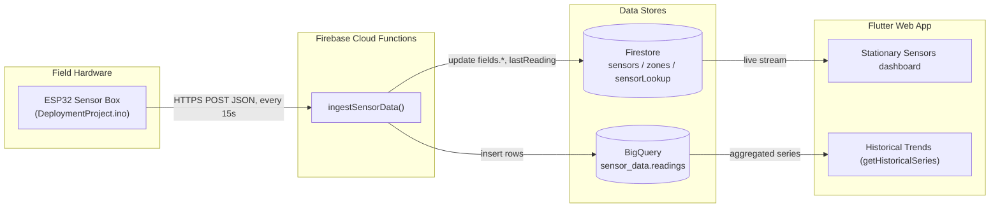
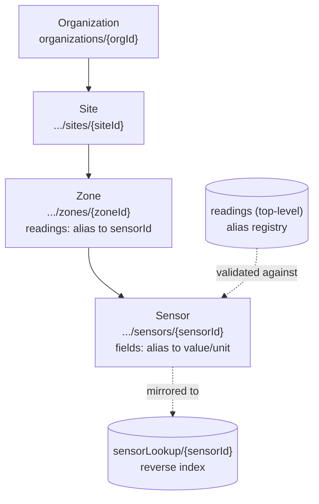
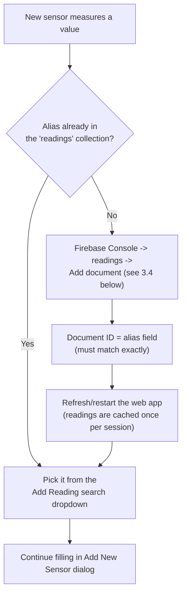
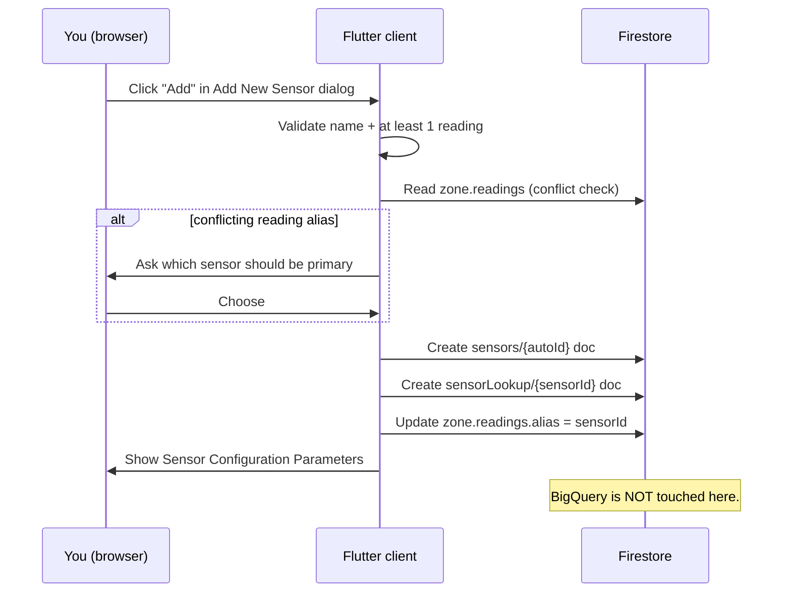
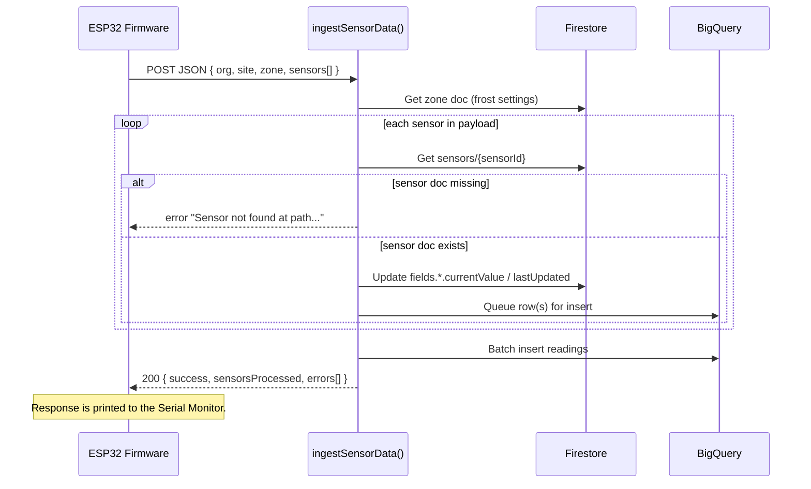

# Sensor Onboarding & Firmware Deployment Guide

Last updated: 2026-07-15

Audience: whoever is registering a new physical sensor (electrical/firmware team) and whoever administers the web app (org owner/admin). For hardware specs and part numbers, see [StationarySensors.md](StationarySensors.md). For the full system architecture, see [Developer-Handoff.md](Developer-Handoff.md) and [DataModel.md](DataModel.md).

This guide walks through the complete path from "we have a new physical sensor" to "its readings show up on the dashboard": registering it in the web app, defining new reading types if needed, understanding what happens in Firestore/BigQuery under the hood, and editing/flashing the Arduino firmware.

---

## 1. System overview

Every sensor reading takes the same path from hardware to dashboard:



Two things only work if they're set up **before** firmware goes live:

1. A Firestore **sensor document** must already exist for every `sensorId` the firmware sends — `ingestSensorData` looks it up and fails with `"Sensor not found at path..."` if it doesn't.
2. Every reading field name (`temperature`, `soilMoisture`, etc.) the firmware sends should already be a registered **reading alias** — otherwise the app can't display it with a friendly name or the right unit picker.

## 2. Data hierarchy



- **Organization / Site / Zone / Sensor IDs** are all Firestore auto-generated document IDs — nobody invents them, they're generated when the doc is created in the app and then copied into firmware.
- A **zone's `readings` map** (`{alias: sensorId}`) decides which sensor is treated as the "primary" source for a given measurement type — this is what actually drives the dashboard tiles and historical charts. A zone can have multiple sensors reporting the same alias, but only one is primary at a time.
- The top-level **`readings`** collection is the registry of valid measurement types (alias, display name, description, valid units, default unit). It has no in-app editor — see Section 4b.
- **`sensorLookup`** is a denormalized reverse index (sensorId → org/site/zone path) used for fast lookups without walking the nested collection path.

## 3. Register a sensor from the web app

### 3.1 Select the zone

The site/zone picker is the pill at the top of the page (📍 icon, e.g. "Vineyard"), **not** a dropdown as the in-app help text currently (inaccurately) describes:

1. Click the site/zone pill.
2. In the "Select Location" sheet, click the **expand arrow** on the site row (not the row itself, not the pencil icon) to reveal its zones.
3. Click the specific zone. The pill now reads `Site › Zone`, and the gear icon (Sensor Configuration) will open instead of showing "select a zone" snackbar.

### 3.2 Open the Add Sensor dialog

Click the gear icon → the Sensor Configuration dialog opens for that zone → click the **+** icon → "Add New Sensor" dialog opens.

### 3.3 Fill in the sensor

- **Sensor Name** (required)
- **Sensor Model** (optional, free text — e.g. `DHT22`)
- **Location** (optional lat/long)
- **Readings** — click **+** next to "Readings," search/select a reading alias, then pick its unit. Repeat for every measurement this physical sensor reports (e.g. a DHT22 needs both `temperature` and `humidity`).

### 3.4 If the reading type doesn't exist yet



There is no in-app way to create a new reading type — the search dropdown only lists what's already in Firestore. To add one:

1. Firebase Console → Firestore Database → top-level **`readings`** collection → **Add document**.
2. **Document ID**: the new alias in camelCase, e.g. `windSpeed`.
3. Fields:

   | field | type | example |
   |---|---|---|
   | `alias` | string | `windSpeed` — **must exactly match the Document ID** |
   | `name` | string | `Wind Speed` |
   | `description` | string | `Wind speed at sensor mast` |
   | `validUnits` | array\<string\> | `["mph", "km/h"]` |
   | `defaultUnit` | string | `mph` |

4. Save, then refresh/restart the web app (the reading list is loaded once per session and cached), and the new alias will appear in the search dropdown.

> **Why the Document ID must equal the `alias` field:** the Flutter app caches readings keyed by the `alias` *field value*, but `ingestSensorData` (the Cloud Function) validates incoming data against the Firestore **document ID**. If these two ever differ, the Cloud Function will log `"Warning: Reading alias '...' not found in readings collection"` on every ingest for that field, even though the app UI works fine. Keep them identical.

### 3.5 Click Add

If any reading you're adding conflicts with an existing sensor already marked primary for that alias in the zone, a dialog asks which sensor should be primary going forward. Resolve it, and the sensor is created.

A **"Sensor Configuration Parameters"** dialog then shows the **Organization ID / Site ID / Zone ID / Sensor ID** — copy all four; you'll need them for the firmware.

## 4. What happens in the background when you click "Add"

Everything here is a **direct Firestore write from the browser** — no Cloud Function runs, and BigQuery is not touched at all yet.



1. **`sensors/{autoId}`** created under the zone, with `fields.{alias}` starting at `currentValue: null` — populated only once real data arrives.
2. **`sensorLookup/{sensorId}`** created at the top level, mirroring org/site/zone/sensor path + field list, for fast reverse lookups.
3. **`zone.readings.{alias}`** patched to point at the new sensor, if it won the primary/conflict resolution — this is what makes the reading show up as a dashboard tile.

## 5. Update and deploy the firmware

### 5.1 Edit `DeploymentProject.ino`

For each new sensor registered above, add (mirroring the existing pattern in the file):

1. **A sensor ID constant** — the value copied from Section 3.5:
   ```cpp
   const char* SENSOR_ID_WIND = "the-sensor-id-from-the-app-dialog";
   ```
2. **Reading alias constants** — only if new, and must match the alias exactly:
   ```cpp
   const char* READING_WIND_SPEED = "windSpeed";
   ```
3. **Unit constants**, if new.
4. **Actual sensor-read code** — a variable plus driver/read logic in `loop()`, same as the existing DHT/SGP30/VEML7700/Modbus reads. This is the real wiring/electrical work.
5. **A new JSON block** inside the `sensors` array in `sendDataToCloud()`, following the existing pattern exactly:
   ```cpp
   jsonPayload += ",{";
   jsonPayload += "\"sensorId\":\"" + String(SENSOR_ID_WIND) + "\",";
   jsonPayload += "\"timestamp\":" + String(timestamp) + ",";
   jsonPayload += "\"readings\":{";
   jsonPayload += "\"" + String(READING_WIND_SPEED) + "\":{\"value\":" + String(windSpeed, 1) + ",\"unit\":\"mph\"}";
   jsonPayload += "}";
   jsonPayload += "}";
   ```
   The payload is built by raw string concatenation — **commas between sensor objects are easy to get wrong**. If your new block isn't the last one, it needs a trailing comma; if it *is* the last one, the block before it needs the trailing comma instead (and nothing after your new block).

If the new sensor is wired into an *existing* physical box, edit that box's `.ino` directly. If it's a brand-new physical box at a different location, you're working from a copy of this file with its own `ORGANIZATION_ID` / `SITE_ID` / `ZONE_ID` and sensor IDs.

### 5.2 What happens on the server when firmware sends data



### 5.3 Flash it to the board

"Deploying" firmware means physically writing the compiled code onto the ESP32 over USB — not a cloud deploy:

1. Open `DeploymentProject.ino` in the **Arduino IDE**.
2. Confirm required libraries are installed: `Adafruit SGP30`, `Adafruit VEML7700`, `DHT sensor library`, `ModbusMaster`.
3. Plug the ESP32 box in via USB.
4. **Tools → Board** → select the correct ESP32 board variant.
5. **Tools → Port** → select the box's COM port.
6. Click **Verify** to compile and catch syntax errors first.
7. Click **Upload** to flash the binary onto the board (it reboots running the new code).
8. Open the **Serial Monitor** at **115200 baud**. Every 15 seconds you'll see the exact JSON payload sent and the cloud's response (`Cloud response code:` / `Cloud response:`). This is your live feedback loop — a `"Sensor not found at path..."` response means Section 3 wasn't completed (or the wrong ID was copied) before flashing.
9. Once you see HTTP `200` and `"success":true`, the box is live. Unplug from USB and mount it in the field — it only needs power + WiFi from then on.

**Always complete Section 3 (register the sensor in the app) before flashing new sensor IDs into firmware.** Doing it in the other order means every POST from the new sensor block fails until the app-side doc exists — harder to debug live in the field than at a desk.

## 6. Troubleshooting quick reference

| Symptom | Cause | Fix |
|---|---|---|
| Gear icon shows "select a specific Zone" snackbar | No zone selected — the site/zone pill was mistaken for read-only text | Click the pill, expand the site, click a zone (Section 3.1) |
| Serial Monitor shows `"Sensor not found at path..."` | Firmware has a `sensorId` with no matching Firestore doc | Complete Section 3 for that sensor before flashing, and double check the copied ID |
| Cloud Function logs `Warning: Reading alias '...' not found` | The `readings` doc's ID doesn't match its own `alias` field | Fix the doc so Document ID == `alias` field (Section 3.4) |
| New reading type doesn't show up in the Add Reading search | Web app cached the `readings` collection before you added the new doc | Refresh/restart the app |
| Malformed JSON / 400 from `ingestSensorData` | Comma placement wrong when adding a new sensor block in `.ino` | Recheck trailing commas between objects in the `sensors` array (Section 5.1) |
| Sensor tile shows "Sensor not found" or "Reading not available" on dashboard | Zone's `readings.{alias}` points at a sensor that doesn't exist, or that sensor has no data for that field yet | Confirm `zone.readings` mapping and that firmware has successfully POSTed at least once |

## 7. Reference: where this logic lives in code

| Concern | File |
|---|---|
| Sensor creation (Firestore writes) | `application/agrivoltaics_flutter_app/lib/services/sensor_service.dart` |
| Add Sensor dialog UI | `application/agrivoltaics_flutter_app/lib/pages/stationary_dashboard/dialogs/add_sensor_dialog.dart` |
| Sensor config params dialog (ID display) | `application/agrivoltaics_flutter_app/lib/pages/stationary_dashboard/dialogs/sensor_config_params_dialog.dart` |
| Reading alias cache | `application/agrivoltaics_flutter_app/lib/services/readings_service.dart` |
| Zone primary-sensor mapping | `application/agrivoltaics_flutter_app/lib/services/zone_service.dart` |
| Site/zone selector | `application/agrivoltaics_flutter_app/lib/pages/home/site_zone_breadcrumb.dart` |
| Ingest Cloud Function | `functions/handlers/ingestSensorData.js` |
| BigQuery table setup | `functions/handlers/setupBigQuery.js` |
| Firestore data model reference | `docs/DataModel.md` |
| Reference firmware | `application/arduino/DeploymentProject.ino` |
| Hardware part specs | `docs/StationarySensors.md` |
